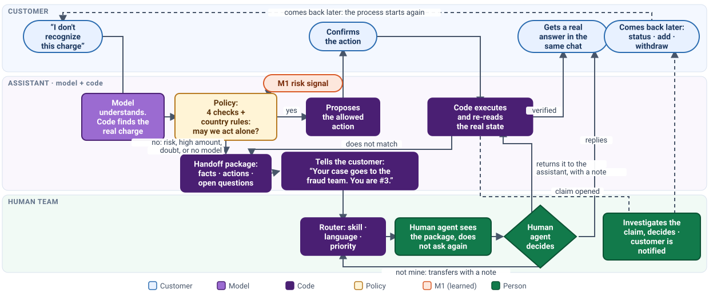
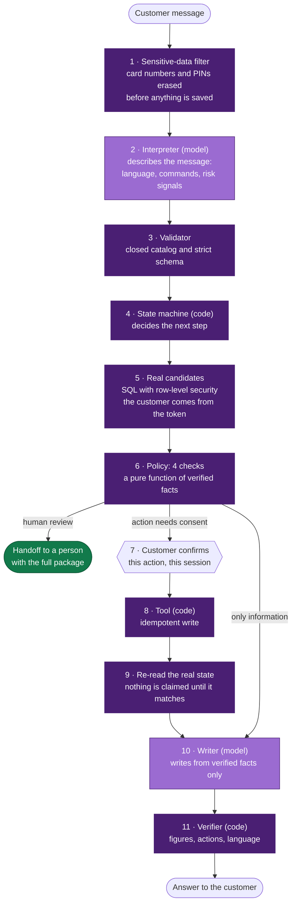
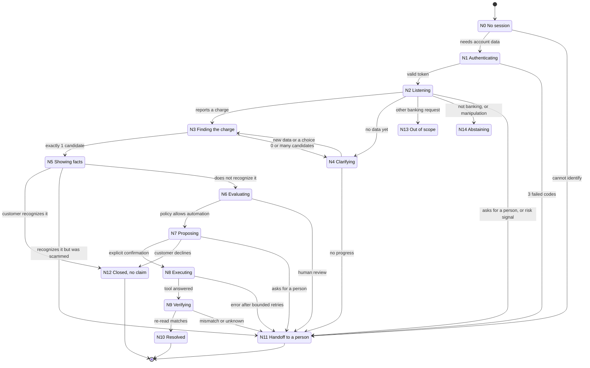
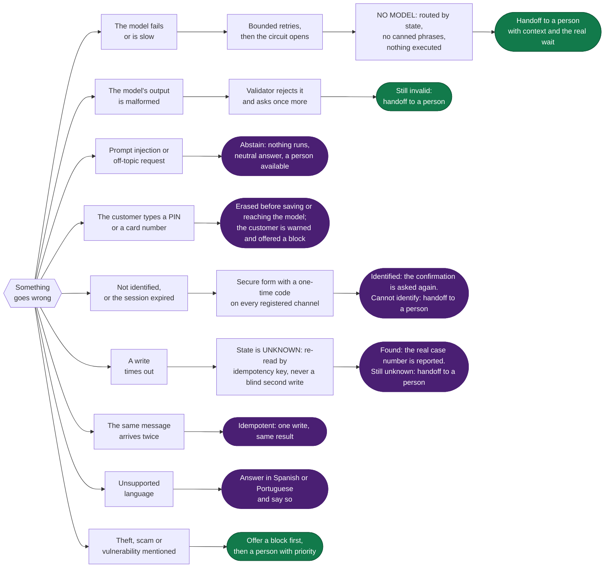

# Architecture diagrams / Diagramas de la arquitectura

**Diseño de arquitectura:** Daniel Pineda González  
**Qué responde:** cómo fluye un turno, cómo se mueve la conversación y qué hace el sistema cuando algo sale mal.  
Los diagramas están en inglés para quien evalúe sin leer español; cada uno nombra el nodo o documento donde está el detalle.

The model understands; the code decides. Three drawings show it: one turn, the conversation states, and every exception.

## 0. The whole map: macro-process, processes, procedures

Escalation: when the policy says "not alone" (risk, high amount, doubt, no model) or a re-read does not match, the code builds the handoff package,
**tells the customer who takes the case and the expected wait**, and the router sends it to the right team. **The way back:** the agent sees the package
and does not ask again; they answer in the same chat, **return the case to the assistant with a note**, or transfer it with a note. An open claim follows
its investigation and the customer is told when it closes; when the customer comes back, the process starts again from the last re-read event.

| Level | What it is | Where it lives |
|---|---|---|
| Macro-process | Handle an unrecognized charge, end to end | this page · `PROCESOS.md` §0 |
| Processes P1–P9 | Each flow with its trigger and end | `docs/PROCESOS.md` (BPMN-style lanes; no BPM engine) |
| State machine N0–N14 | Conversation steps and edges | `docs/ARQUITECTURA.md` §6 · `servicio/orquestador/` |
| Policy (admissibility filter: four checks that must all pass) | Four checks run by code + country rules | `servicio/politica/motor.py` · `politica/comun.yaml`, `politica/{mx,co,ar}.yaml` |
| Procedures | Agent guides, protocols, knowledge articles | `config/guias_asesor.yaml` · `docs/CASOS.md` · `conocimiento/` |
| Evidence | Execution log, database re-read, evaluation | `evaluacion/` |

## 1. One turn, end to end

Purple boxes are the only places a language model is used. Everything else is code with a contract, or a person.

*Detail: `ARQUITECTURA.md` §3 and §6.*

## 2. The conversation state machine

Fifteen nodes. The state is saved in the database at every turn: there is no hidden memory.

An expired or invalid token sends any node back to N1 (the confirmation is asked again after re-identifying).
A side question (hours, how a claim works) is answered and the conversation returns to the same node, untouched.

*Detail: `ARQUITECTURA.md` §6.1 and §6.2.*

## 3. When something goes wrong

Every exception ends in one of three safe outcomes: the system retries within a bound, it asks the customer, or a person takes the case. It never invents an answer and never claims an action it did not verify.

*Detail: `ARQUITECTURA.md` §7, `SEGURIDAD.md` and `PROCESOS.md`.*

## 4. Who decides what

| Decision | Model | Code | Person |
|---|---|---|---|
| What the customer meant, and in which language | ✔ describes it | validates it against a closed catalog | |
| Which transaction it is | the Comparator suggests an alias | checks it against the real list | the customer confirms |
| Whether an action is allowed | | ✔ pure function of verified facts | |
| Executing and verifying | | ✔ idempotent tool and re-read | |
| What the customer reads | ✔ writes it from verified facts | ✔ checks figures, actions and language | |
| Cases with risk, money at stake or doubt | | routes and prioritizes | ✔ decides |
