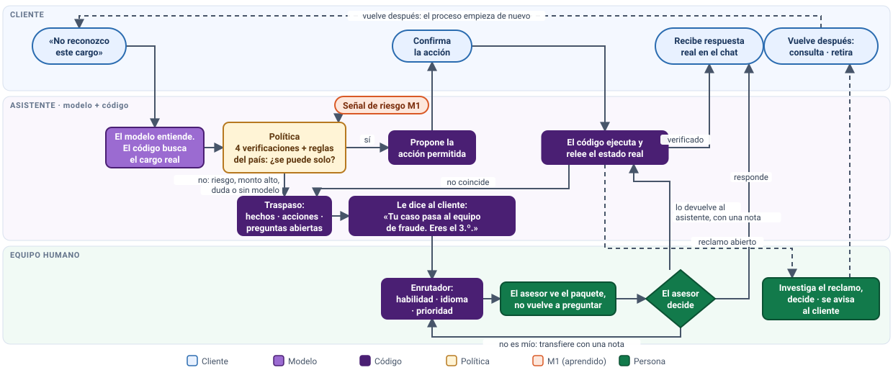
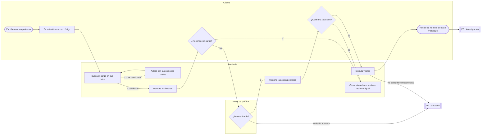
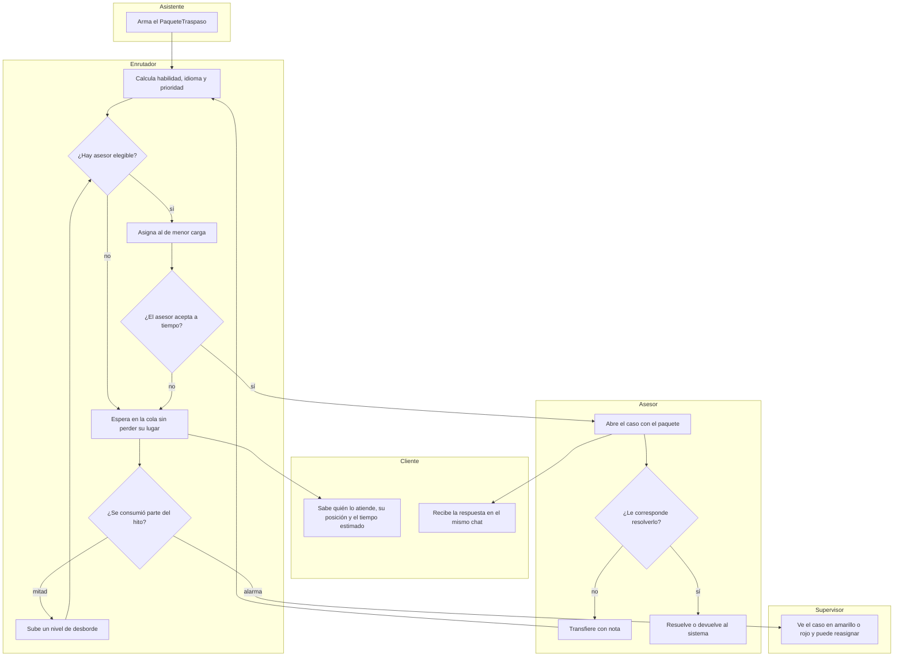
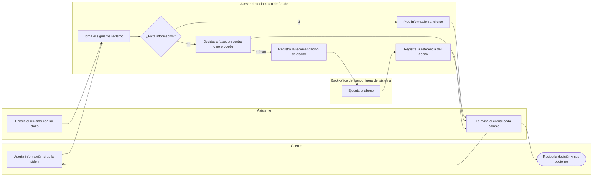

# PROCESOS — cómo fluye un caso de punta a punta, entre todos los actores

**Diseño de arquitectura:** Daniel Pineda González  
**Qué responde:** cómo fluye un caso de punta a punta entre todos los actores. Une lo que los demás planos describen
por pieza: el grafo de la conversación (`ARQUITECTURA.md` §6), los ciclos de vida (`MODELO_DATOS.md` §3) y los roles
(`ROLES_Y_ACCESOS.md`). Un proceso no agrega reglas propias: si una regla aparece aquí, su fuente es la que se cita.

**Notación:** diagramas de flujo con **carriles**, uno por actor, al estilo BPMN 2.0 (Object Management Group, 2014), escritos en Mermaid para que
vivan en el repositorio y se lean en GitHub. No hay motor de procesos: lo que corre son las máquinas de estado ya
diseñadas. El proceso es el plano que las conecta.

| # | Proceso | Disparador | Termina cuando |
|---|---|---|---|
| P1 | Reportar un cargo no reconocido | El cliente escribe | Reclamo abierto y verificado, cierre sin reclamo, o traspaso |
| P2 | Traspaso y atención humana | P1, P4, P5 o P6 piden una persona | El asesor resuelve o devuelve el caso al sistema |
| P3 | Investigación del reclamo | Se abre un reclamo | Reclamo cerrado y el cliente informado |
| P4 | Bloqueo y desbloqueo de un producto | El cliente o la política | Producto en el estado pedido, releído |
| P5 | Volver: consultar, completar o retirar | El cliente vuelve | Respuesta con el último evento releído |
| P6 | Solicitudes fuera del flujo | Otra gestión o un derecho del titular | Solicitud registrada y traspasada |
| P7 | Mejora de la base de conocimiento | Un asesor encuentra un hueco o un error | Artículo nuevo o corregido, publicado con versión |
| P8 | Sin modelo | El proveedor cae, se agota el cupo, la interpretación o redacción de una conversación falla tras su reintento, o una falla no prevista revierte el turno | Cada conversación afectada está con una persona, y el cliente ve el estado real de su espera |
| P9 | Parámetros de operación | El banco decide cambiar un valor de operación | El valor nuevo rige desde el turno siguiente, con su evento |

---

## 0. El mapa de todo: macroproceso, procesos, procedimientos y dónde vive cada cosa

El dibujo se genera con `docs/presentacion/mapa_proceso.py`. Lee así: el cliente escribe; el **modelo** entiende y el **código** busca el cargo real;
la **política** decide si se puede actuar solo. Si sí, se propone la acción, el cliente confirma, el código la ejecuta y **relee** el estado real
antes de decir que está hecho. Si no (riesgo, monto alto, duda o sin modelo) —o si lo releído no coincide— el caso **escala**: se arma el paquete de traspaso,
**se le dice al cliente a quién pasa y cuánto espera**, y el enrutador lo manda al equipo humano. **La vuelta:** el asesor ve el paquete y no vuelve a preguntar;
decide y responde en el mismo chat, o **devuelve el caso al asistente con una nota**, o lo transfiere a otro equipo con una nota. Un reclamo abierto sigue su
investigación (P3) y al cerrarse se avisa al cliente; cuando el cliente vuelve (P5), el proceso empieza de nuevo con el último evento releído.

| Nivel | Qué es | Dónde vive | Quién lo ejecuta |
|---|---|---|---|
| **Macroproceso** | "Atender un cargo no reconocido": de lo que escribe el cliente hasta que queda resuelto y verificado | Este documento (la tabla de abajo y el dibujo) | Todos los actores |
| **Procesos** P1–P9 | Cada flujo con su disparador y su fin | `docs/PROCESOS.md` (carriles al estilo BPMN, sin motor BPM) | Las máquinas de estado |
| **Máquina de estados** N0–N14 | Los pasos de la conversación y sus bordes | `docs/ARQUITECTURA.md` §6 · `servicio/orquestador/` | El código |
| **Política** | Qué acciones se pueden hacer solas: cuatro verificaciones + reglas del país. Es el **filtro de admisibilidad**: la acción se hace sola solo si las cuatro cumplen | `servicio/politica/motor.py` · datos en `politica/comun.yaml` y `politica/{mx,co,ar}.yaml` · `docs/ARQUITECTURA.md` §8.3 | El código (el modelo no decide) |
| **Procedimientos** | Qué hace una persona y qué se le responde al cliente | Guías del asesor `config/guias_asesor.yaml` · protocolos PR-x en `docs/CASOS.md` · artículos `conocimiento/` | El asesor y el modelo que redacta con esos hechos |
| **Evidencia** | Lo que prueba que ocurrió | Registro de ejecución, relectura en base, evaluación `evaluacion/` | El código |

**BPM:** aquí el diagrama es un **plano** (BPMN como notación) y no un motor: no se importa un archivo a una herramienta BPM; lo que corre son las máquinas de estado
y la política, y el plano las conecta. Así cada flecha del dibujo tiene un nodo de código y una prueba que la respalda.

---

## P1. Reportar un cargo no reconocido

- **Dos entradas al mismo flujo.** Así lo hacen los bancos digitales: en Nu México, Nubank, Revolut o Bank of
  America el cliente elige el movimiento en la app y pulsa "reportar esta compra", escoge el motivo, responde unas
  preguntas y adjunta evidencia si hace falta; el chat queda para lo demás (Nu México, s. f.-a, s. f.-b; Nubank, s. f.-d; Revolut, s. f.; Bank of America, s. f.; Banking Dive, 2022). Aquí:
  - **desde el movimiento:** el cliente abre sus movimientos en el chat y pulsa "no reconozco este cargo". El cargo ya
    está identificado (N5 directo, sin ambigüedad);
  - **desde la conversación:** escribe con sus palabras y el sistema encuentra el cargo (N2 → N3).

  Las dos siguen el mismo grafo, la misma política y la misma verificación.
- **Reglas:** el grafo, sus guardas y las rutas por intención están en `ARQUITECTURA.md` §6. Una señal de riesgo
  (engaño, coacción, credencial comprometida, producto en manos de otro) en cualquier turno lleva a P2 de inmediato,
  con el bloqueo ofrecido.
- **El cliente puede pedir una persona en cualquier paso** (promesa P3 de `EXPERIENCIA_CLIENTE.md`).
- **"Abierto" no es "resuelto":** abrir el reclamo termina P1 y empieza P3. Al cliente se le dice que su caso está
  registrado y quién lo revisa, nunca que "se resolvió".

---

## P2. Traspaso y atención humana (el enrutador)

Es el proceso que decide **quién** atiende y **cuándo**. Sigue la práctica estándar de enrutamiento por habilidades
de los centros de contacto: el trabajo va al asesor disponible que tiene todas las habilidades pedidas y capacidad
libre (Salesforce, s. f.-b, s. f.-c). La plantilla de asesores sale de los datos (`01_DIAGNOSTICO.md` §2.6). Los parámetros viven en un solo
archivo versionado, `config/atencion_humana.yaml`.

### P2.1 Dos tipos de trabajo, dos canales

| Tipo | Canal del asesor | Qué es | Capacidad |
|---|---|---|---|
| **Conversación en vivo** (`traspaso`) | chat | El cliente está (o puede volver) en el chat esperando a una persona | 1 a 3 simultáneas, la elige el asesor |
| **Reclamo por investigar** | back-office | Un reclamo abierto que alguien tiene que decidir (P3) | 1 a la vez; el asesor pide el siguiente |

El asesor elige el canal al conectarse, como en la herramienta de atención de Nubank, donde el mismo asesor pasa entre
chat, correo, teléfono y back-office, fija cuántos chats toma a la vez y el sistema se los asigna (Nubank, s. f.-b, s. f.-a).

### P2.2 Qué habilidad necesita el caso

Sale del `motivo_traspaso` del paquete (catálogo único, `CONTRATOS.md`). Si hay varios motivos, gana el más exigente:
`fraude` > `reclamos` > `general`.

| Habilidad | Motivos |
|---|---|
| `fraude` | Engaño por tercero, coacción, credencial comprometida, producto en manos de otro (robo o pérdida), 3 códigos fallidos, bloqueo recomendado por riesgo, desbloqueo tras riesgo, tipo `no_autorizada` o `estafa_autorizada` no automatizable |
| `reclamos` | Revisión humana por política (monto sobre el umbral del país, señal de riesgo en la zona de incertidumbre, sin score, 2+ reclamos en 90 días, jurisdicción o monto desconocidos, moneda incoherente, fuera de la ventana de reclamo), error de procesamiento, disputa de consumo, acción en estado desconocido |
| `general` | Pedir una persona sin otro motivo, estancamiento, fuera de alcance, derechos del titular, identidad no verificada sin señal de riesgo |

El idioma es el del cliente (es o pt). **El sistema nunca le cambia el idioma al cliente.**

### P2.3 Prioridad y orden de la cola

| Prioridad | Cuándo | Primera respuesta comprometida (hito) |
|---|---|---|
| 1 · Seguridad | Engaño, coacción, credencial comprometida, producto en manos de otro (robo o pérdida), códigos fallidos, o una señal de riesgo sobre el umbral certificado (el producto puede estar siendo usado para robar ahora) | 2 min |
| 2 · Vulnerabilidad | Señal `vulnerabilidad_declarada` | 5 min |
| 3 · Plazo o dinero en juego | El plazo normativo del caso vence en 2 días hábiles o menos, o el movimiento no reconocido está en el 10 % más alto de su tipo | 10 min |
| 4 · Resto | Todo lo demás | 20 min |

Los días hábiles se cuentan de lunes a viernes, sin feriados (simplificación declarada). Los minutos son **valores
de diseño declarados**, no una norma: los datos no traen un proceso que calibrar
(`01_DIAGNOSTICO.md` §2.6). Se miden en la demo y se reportan.

**Dinero en juego (prioridad 3).** "Alto" es relativo al tipo de movimiento: el cuantil 0,9 del monto en dólares de
cada tipo, calculado sobre los 3,8 millones de movimientos de los datos (`pipeline/dinero_en_juego.py` →
`artefactos/dinero_en_juego.json`; el cuantil vive en `politica/comun.yaml`). Por construcción sube como mucho uno
de cada diez reclamos, así que la prioridad 3 no se satura, y nunca pasa delante de seguridad ni de vulnerabilidad.
No es una señal de fraude: en los datos la tasa de fraude es la misma en todo tramo de monto (0,1 %); es el daño
posible para el cliente. Se aplica al traspaso y a la cola de investigación del reclamo, y el asesor ve la etiqueta.

**Orden dentro de la cola**, en este orden de desempate:
1. prioridad;
2. casos en alarma (80% del hito consumido) primero: **nadie vence por ceder su lugar a otro**;
3. segmento Premium antes que los demás (decisión de negocio declarada; no toca la política, `ROLES_Y_ACCESOS.md` §1);
4. orden de llegada.

**La prioridad manda sobre la espera:** un caso normal que lleva horas nunca pasa delante de un posible fraude en
curso. La alarma (paso 2) solo reordena casos del mismo nivel. En la práctica, seguridad y resto casi no compiten:
van a asesores de habilidades distintas (§P2.2) y solo se cruzan en el nivel 2 de desborde.

**Envejecimiento, para que nadie quede olvidado:** cuando a un caso de prioridad 4 se le vence su hito, sube a la 3,
con un hito nuevo contado desde la subida, y el supervisor lo ve en rojo. No sube más: la prioridad 2 es una
condición del cliente (vulnerabilidad) y la 1 la da solo una señal de seguridad. Un caso de prioridad 3 con el hito
vencido queda en rojo para el supervisor. Así, una ráfaga de casos urgentes retrasa a los demás, pero no los
deja esperando para siempre.

Una transferencia con nota **conserva la hora de llegada original**: el caso no vuelve al final de la fila.

### P2.4 Quién es elegible y a quién se asigna

> **En la demo** (declarado en `config/atencion_humana.yaml`): las identidades de demo están siempre en turno y reciben casos de **cualquier** habilidad
> (el idioma sí se respeta), para que quien entra no tenga que adivinar con qué asesor hacerlo. La regla de abajo es la de producción. Un caso
> **transferido** no vuelve a quien lo transfirió.

Un asesor es elegible si cumple **todo**:
- está `disponible` y su carga es menor que su capacidad en ese canal;
- está dentro de su turno y faltan más de 15 minutos para que termine;
- tiene la habilidad que pide el nivel de desborde actual (§P2.5) y habla el idioma del caso;
- atiende el canal (chat: `Digital` o `Hybrid`).

**Entre varios elegibles:** el de menor carga relativa (carga ÷ capacidad). Si empatan, el que lleva más tiempo sin
recibir un caso, para repartir el trabajo con justicia. Si vuelven a empatar, el código de empleado.

**La asignación es una escritura condicional** (`INV-ESCRITURA`): la carga del asesor se relee y se incrementa en la
misma transacción; si otro caso ocupó ese cupo, se intenta con el siguiente elegible. Nunca se supera la capacidad.

**Un solo traspaso activo por conversación:** si el cliente vuelve a pedir una persona mientras espera, se le
informa su posición y su tiempo estimado; no se crea otro traspaso ni pierde su lugar.

**Asignación empujada con aceptación:** el caso llega al asesor, que tiene **60 s** para abrirlo. Si no lo abre, el
caso vuelve a la cola **en su mismo lugar**, el asesor pasa a `ausente` y el supervisor ve el evento.

### P2.5 Desborde por niveles (cuando no hay nadie)

La plantilla real lo obliga: en chat y en portugués hay solo 2 especialistas de fraude, los dos de mañana
(`01_DIAGNOSTICO.md` §2.6).

| Nivel | Se activa | Habilidades aceptadas | Qué más pasa |
|---|---|---|---|
| 0 | Al entrar | La requerida | — |
| 1 | Consumido el 50% del hito | La requerida o la afín (`fraude` ↔ `reclamos`) | Evento de desborde |
| 2 | Consumido el 80% del hito (alarma) | Cualquiera, incluida `general` | El supervisor lo ve en amarillo. Un asesor `general` atiende, pero no puede hacer las acciones reservadas a `fraude`; si hacen falta, transfiere con nota |
| 3 | No hay nadie con el idioma del caso en turno | — | El caso queda registrado y el supervisor lo ve en rojo. El cliente recibe la verdad: cuándo abre el siguiente turno con su idioma, y si hay alguien en turno que hable español, un botón para seguir en español. Si lo acepta, el caso vuelve al nivel 0 en español con su llegada intacta y queda el evento; el sistema nunca cambia el idioma por su cuenta |

### P2.6 Lo que el cliente ve mientras espera (promesa P4)

- **Tiempo estimado de espera**, adaptado de la fórmula de los centros de contacto (Genesys, s. f.; Lakshmikanth, s. f.):
  `espera ≈ TMA × posición ÷ capacidad total de los asesores elegibles conectados en turno` (sin contar los que están
  en pausa), donde TMA es el tiempo medio de atención de esa habilidad. Se usa la capacidad total y no la libre: con
  todos ocupados, la libre es 0 y la espera no es infinita. El valor inicial del TMA es 431 s, la mediana de las llamadas de queja
  (`01_DIAGNOSTICO.md` §2.2), declarado como supuesto; después se mide en la demo.
- Se muestra redondeado hacia arriba, en minutos, y se recalcula con cada consulta del chat. La primera estimación se
  guarda al entrar a la cola: cuando la espera real la supera en un 50 % (`espera_excedida_fraccion`), el aviso lo
  dice con la estimación nueva y el supervisor recibe el evento, una sola vez por caso.
- Si no hay ningún asesor elegible conectado, no se inventa un tiempo: se dice cuándo empieza el siguiente turno.
- Todo aviso lo redacta el sistema con los hechos del evento (`ARQUITECTURA.md` §8.4).

### P2.7 Turnos, pausas y fin de turno

- **Horas por turno** (hora local del país del asesor): mañana 06-14, tarde 14-22, noche 22-06. Los rotativos
  reciben un turno por semana. Los datos traen solo el nombre del turno: las horas son **sintéticas y declaradas**.
- **Estados de presencia:** `desconectado`, `disponible`, `en_pausa`, `ausente` (no aceptó a tiempo). `ocupado` y
  `fuera_de_turno` se calculan: nadie los marca. Cada cambio es un evento de solo agregar.
- **Fin de turno:** 15 minutos antes, el asesor deja de recibir casos. Lo que siga abierto al terminar vuelve a la
  cola con una nota automática, conservando su prioridad y su hora de llegada. Si el cliente estaba esperando, se le
  avisa que otra persona del equipo continúa, con el mismo contexto.

### P2.8 El trabajo del asesor

- **Una sola pantalla:** paquete de traspaso, conversación, hechos verificados, acciones disponibles según su rol y
  habilidad, y la búsqueda en la base de conocimiento interna (`ARQUITECTURA.md` §8.8). Es el patrón de la
  herramienta de Nubank, que junta datos y acciones del cliente en una pantalla (Nubank, s. f.-b, s. f.-a).
- **No le pregunta al cliente lo que ya está en el paquete.**
- **Transferir** exige una nota y una habilidad destino (o el supervisor). No existe la transferencia sin contexto.
- **Devolver al sistema**, con nota, cuando lo que falta es automatizable (por ejemplo, abrir un reclamo que el
  cliente ya confirmó con el asesor).

**Asistencia al asesor (A16).** El sistema ayuda dentro del caso; el asesor decide y responde por lo que envía. Es la
práctica de las herramientas de atención: la de Nubank le ofrece al asesor respuestas listas, ordenadas según su
equipo y el tipo de caso, con los datos del cliente ya puestos (Nubank, s. f.-b, s. f.-a).
1. **Respuesta sugerida:** cuando el asesor pulsa "sugerir", el Redactor escribe un borrador con los hechos
   verificados del caso y la conversación. El asesor lo lee, lo edita y decide enviarlo. **Nunca se envía solo.**
2. **Guía del caso:** los pasos que tocan según el motivo del traspaso, la decisión de la política y el artículo
   interno del tema ("verificar X", "pedir Y", "transferir a fraude si Z"). La arma el código; no la escribe el
   modelo.
3. **Artículos sugeridos:** los de la base de conocimiento que corresponden al tipo de caso, además de la búsqueda
   libre.

Controles:
- el borrador se hace con la **misma información segura** que usa el chat del cliente: sin la señal de riesgo ni el
  camino interno. La evidencia se queda en el panel del asesor;
- lo que escribió el cliente se muestra como **cita del cliente**, nunca como instrucción para el asesor;
- el borrador pasa por el verificador (cifras en marcadores, ninguna acción afirmada que no esté `completada`): no
  puede prometer un abono ni dar por hecho algo que no pasó;
- no propone acciones de fondo (resolver, abonar); esas las decide el asesor con la guía;
- cada mensaje enviado registra su origen: escrito por el asesor, sugerencia sin editar o sugerencia editada;
- sin modelo (caído o cupo agotado), no hay sugerencia: el asesor escribe solo y el caso sigue.

### P2.9 El supervisor

- Ve la cola por habilidad e idioma con semáforo: verde (menos del 50% del hito), amarillo (50-80%), rojo (80% o
  vencido, y todo el nivel 3).
- Reasigna a mano, cambia el estado de un asesor y ve cada evento de desborde, aceptación vencida y fin de turno.

### P2.10 Qué se mide

Tiempo hasta la primera respuesta por prioridad, **por segmento** y por idioma; hitos vencidos; distribución por nivel
de desborde; transferencias por caso; aceptaciones vencidas; conversaciones donde se pidió una persona y no se obtuvo
(objetivo: 0); casos que subieron de prioridad por envejecimiento; sugerencias enviadas sin editar, editadas y
descartadas (una tasa alta sin editar es una señal de confianza ciega que se revisa).

---

## P3. Investigación del reclamo (back-office)

- **Primer contacto y evidencia.** Como referencia, Nu México contacta al cliente en un máximo de 4 días hábiles,
  analiza en menos de 48 h si le da un crédito temporal y resuelve en hasta 45 días las compras nacionales (Nu México, s. f.-a, s. f.-b). Aquí
  el primer contacto del asesor tiene su hito (valor declarado en `config/atencion_humana.yaml`). La evidencia se pide
  solo si el tipo de disputa la necesita (consumo, error de procesamiento) y llega como adjunto (`ARQUITECTURA.md`
  §8.9). Al cliente se le dice desde el principio que abrir un reclamo no asegura la devolución, como lo dice el propio
  banco (Nu México, s. f.-a, s. f.-b).
- **Cola:** todo reclamo abierto entra a la cola de investigación. La habilidad es `fraude` para `no_autorizada` y
  `estafa_autorizada`, y `reclamos` para el resto. El canal es back-office (§P2.1). La cola llega sin datos del
  cliente; el asesor de esa habilidad toma el siguiente (uno a la vez) y, desde ese momento, ve lo necesario para
  investigarlo: el movimiento, las notas, la historia y los adjuntos.
- **Hito:** el plazo normativo del caso según la política del país (`ARQUITECTURA.md` §8.3); si la regla es
  desconocida, rige el plazo interno declarado en `config/atencion_humana.yaml`. La cola y los casos tomados muestran
  los días hábiles que quedan, y con 2 o menos (o vencido) el caso está en alarma, a la vista del supervisor.
- **Ciclo de vida:** el del reclamo (`MODELO_DATOS.md` §3.1). Pedir información, corregir el tipo, resolver, registrar
  el abono y cerrar son acciones del asesor que lo tomó; reabrir es del supervisor, con motivo
  (`ROLES_Y_ACCESOS.md` §3).
- **El dinero nunca lo mueve el sistema:** el asesor registra la recomendación, el back-office la ejecuta fuera y el
  asesor registra la referencia. En la demo, el back-office se simula con esa referencia escrita a mano, declarado.
- **Aviso al cliente:** cada cambio de estado que no hizo el propio cliente deja un aviso con sus hechos (lo registra
  la base, en la misma transacción). Al volver, el asistente le dice cuántas novedades tiene y se las cuenta al
  consultar sus reclamos, incluidos el resultado y, si no queda conforme, a quién puede acudir (la figura regulada de su
  país, `ROLES_Y_ACCESOS.md` §6).
- **Esperando al cliente:** si el cliente no responde en los días que decide el banco (parámetro
  `dias_espera_respuesta_cliente`, §P9), el reclamo se cierra por vencimiento administrativo, con evento del sistema y
  aviso al cliente.

---

## P4. Bloqueo y desbloqueo de un producto

| Paso | Quién | Regla |
|---|---|---|
| Bloquear a pedido | Cliente, con confirmación | Siempre disponible, con cualquier señal de riesgo |
| Recomendar un bloqueo | Asistente | Solo si el umbral certificado lo permite (`02_PLAN.md` §2); el cliente confirma |
| Desbloquear | Cliente, con confirmación | Solo si lo bloqueó él y no hay señal de riesgo |
| Desbloquear tras riesgo | Asesor con habilidad `fraude` | P2 con motivo "desbloqueo tras riesgo" |
| Tarjeta comprometida | Asesor `fraude` | Pasa a `escalado_a_reemplazo`: el reemplazo queda fuera del sistema |
| Robo de tarjeta y de celular (sin código) | Asesor `fraude`, prioridad 1 | Traspaso "identidad no verificada"; el asesor sigue el procedimiento del banco. El sistema no bloquea sin identidad (`ARQUITECTURA.md` §8.11) |

Ciclo de vida: `MODELO_DATOS.md` §3.2. Todo estado se relee antes de comunicarlo.

---

## P5. Volver: consultar, completar o retirar

1. El cliente vuelve y se autentica. La conversación nueva **trae de la base** sus reclamos activos, sus bloqueos y
   los avisos que no leyó (`ARQUITECTURA.md` §8.1, regla 3).
2. Consultar: la respuesta sale del último evento releído.
3. Completar: la nota o el adjunto (ARQUITECTURA §8.9) va al reclamo como evento; si el reclamo estaba esperando al cliente, vuelve a la cola de P3
   con su hora de llegada original.
4. Retirar: con motivo y confirmación, solo si no está resuelto.

**Avisos cuando el cliente no está en el chat:** en la demo quedan como no leídos y se muestran al volver (igual que el
buzón del código de un solo uso). En producción irían por el canal de notificaciones del banco. Declarado.

---

## P6. Solicitudes fuera del flujo

Otra gestión bancaria, un cambio de datos o un derecho del titular (conocer, rectificar, suprimir): el sistema dice
qué sí puede hacer, registra la solicitud con su categoría y la traspasa por P2 con la habilidad `general`. Los
derechos del titular son un proceso humano (`GOBERNANZA_DATOS_IA.md` §6).

---

## P7. Mejora de la base de conocimiento

Sigue el ciclo de *Knowledge-Centered Service* (KCS): el conocimiento se captura mientras se atiende y se mejora con
el uso, en dos lazos, el del caso y el del equipo (Consortium for Service Innovation, s. f.-a).

1. **Durante un caso**, el asesor marca un artículo como "incorrecto", "incompleto" o "falta", con el caso de ejemplo.
2. **El responsable de contenido** revisa, escribe o corrige el artículo con su fuente y su tabla de respaldo, y lo
   propone como *pull request*: queda `pendiente_aprobacion` (`ROLES_Y_ACCESOS.md` §5).
3. **Otra persona lo aprueba** viendo la diferencia con la versión anterior; se vuelven a correr los casos que usan el
   artículo.
4. **Al publicarse**, reemplaza a la versión anterior y el catálogo de temas se regenera, y con él el esquema que lee el
   Intérprete (`ARQUITECTURA.md` §8.6, D-14). Cada respuesta registra la versión del artículo que usó.
5. **Mantenimiento:** revisión periódica según su criticidad, vigilancia semanal de las fuentes y cortacircuitos
   (`GOBERNANZA_DATOS_IA.md` §11.5-§11.8).

---

## P8. Sin modelo

Cuando no hay modelo (el proveedor cayó, el guardián de cupo lo da por agotado, o la interpretación o la redacción de
una conversación fallaron tras su reintento), o cuando una falla no prevista del código revirtió el turno, el sistema **no improvisa, no usa frases de respaldo y no se queda en
silencio**: pasa la conversación a una persona y el cliente ve el estado real de su espera.

| Paso | Qué pasa |
|---|---|
| 1. Se activa | El circuito se abre o el cupo se agota (global), o una conversación falla tras su reintento (solo esa). Queda un evento y el supervisor ve una **alarma roja** |
| 2. Nada se ejecuta | Ninguna acción se ejecuta. La acción que estaba pendiente queda como propuesta en el paquete |
| 3. Traspaso | A11 elige habilidad y prioridad con lo que el estado ya sabe (nodo, cargo en curso, señales; sin nada, `general`). Paquete marcado "sin resumen de IA": lo verificado hasta ese turno, adjuntos y el enlace a la conversación. El asesor no pregunta lo ya dicho |
| 4. Qué ve el cliente | El **aviso de espera** de la interfaz (`INTERFACES.md` §1): número de caso, posición y tiempo estimado reales, o la hora en que abre la atención, con datos de A14. No es un mensaje redactado ni una frase: la siguiente palabra que lee el cliente es de la persona |
| 5. Atención | Los asesores atienden sin respuesta sugerida (escriben ellos). Si la cola no da abasto, el aviso de espera muestra el caso registrado con su número y la respuesta llega al mismo chat |
| 6. Vuelve el modelo | El circuito se cierra con una prueba. Las conversaciones que ya tiene una persona **se quedan con ella**; las nuevas vuelven al flujo normal |

**Lo que nunca pasa sin modelo:** frases fijas, acciones ejecutadas, un tiempo inventado o una conversación sin
respuesta.

---

## P9. Parámetros de operación

Hay valores que decide el banco y no el código: cuánto puede gastar en el modelo una conversación antes de seguir con
una persona, o cuántos días espera un reclamo la respuesta del cliente. Cada banco los fija según su presupuesto y su
servicio, y los cambia con el tiempo.

| Parámetro | Valor inicial | Qué hace |
|---|---|---|
| `presupuesto_tokens_conversacion` | 80.000 tokens (unos 18 turnos, medido) | Al agotarse, la conversación no se corta: sigue con una persona. 0 = sin tope |
| `dias_espera_respuesta_cliente` | 10 días | Un reclamo que espera información del cliente se cierra por vencimiento, con aviso |

- **Dónde viven:** el valor inicial en `config/parametros_operacion.yaml`; el vigente, en `operacion.parametros`.
- **Quién los cambia:** un supervisor, desde la operación, con motivo obligatorio y dentro del rango declarado. Cada
  cambio queda como evento de solo agregar (quién, cuándo, de qué valor a cuál y por qué) y rige desde el turno
  siguiente, sin reiniciar nada.
- **Quién los ve:** la cabina del sistema muestra el valor vigente, de dónde sale y, para el presupuesto, cuántas
  conversaciones llegaron al tope en la ventana elegida.

## Qué se construye y qué queda declarado

| Pieza | En la demo | Declarado para producción |
|---|---|---|
| P1, P4, P5 | Completos | Canal de notificaciones del banco |
| P2 enrutador | Habilidad, idioma, prioridad (con envejecimiento y dinero en juego), segmento, capacidad, aceptación de 60 s, desborde 0-3 con oferta de español en el nivel 3, tiempo estimado con aviso de espera excedida, semáforo, transferencia con nota, reasignación del supervisor | Plataforma de centro de contacto del banco; dimensionamiento de personal (Erlang) |
| P2 turnos | Horas sintéticas por turno, sobre los asesores reales de la demo | Calendario real de turnos |
| P2 asistencia al asesor | Respuesta sugerida, guía del caso y artículos sugeridos | — |
| P2 asesores de la demo | Las identidades con las que entran el jurado y el equipo reciben casos. El resto de la plantilla se simula solo como **presencia y carga** (ocupados, en pausa, fuera de turno) para que la cola y el tiempo estimado sean realistas; un asesor simulado nunca recibe un caso | Asesores reales conectados |
| P3 investigación | Cola de back-office sin datos del cliente, alarma de plazo, pedir información, corregir el tipo, decisión con fundamento, referencia del abono, cierre, reapertura, avisos al cliente y cierre por vencimiento | Integración con el back-office de tarjetas y abonos |
| P6 | Registro y traspaso | Flujo propio de derechos del titular |
| P8 | Completo: traspaso por el estado, aviso de espera y la prueba candado sin frases; también ante una falla no prevista del código | Plan de contingencia de personal durante una caída |
| Entradas | Nada bloquea; imágenes y PDF como evidencia; entrada desde el movimiento | Voz como canal; transcripción de notas de voz |
| P7 | Marcas del asesor, artículos versionados, revisión periódica, vigilancia semanal de fuentes y cortacircuitos | Herramienta de gestión de conocimiento |
| P9 | Presupuesto por conversación y días de espera al cliente, cambiados por el supervisor con motivo | — |

## Referencias

Completas, en formato APA 7, en `BIBLIOGRAFIA.md`.
